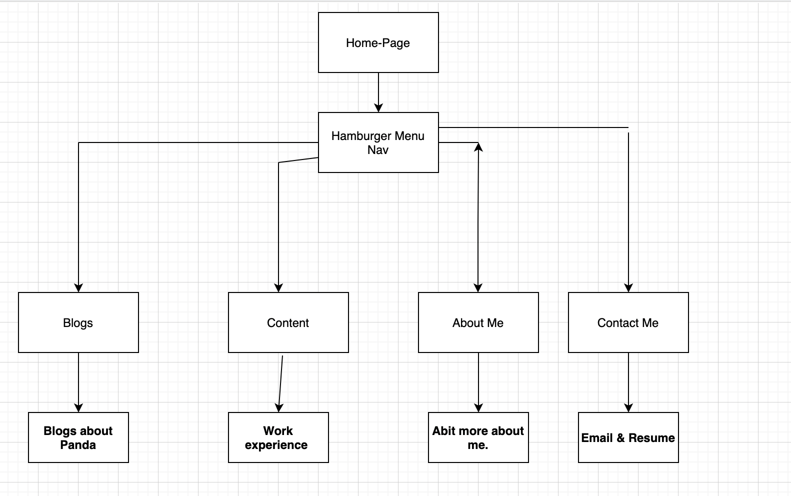
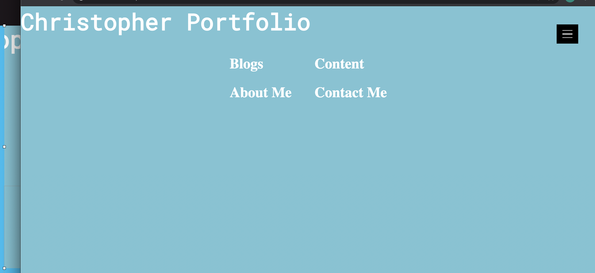
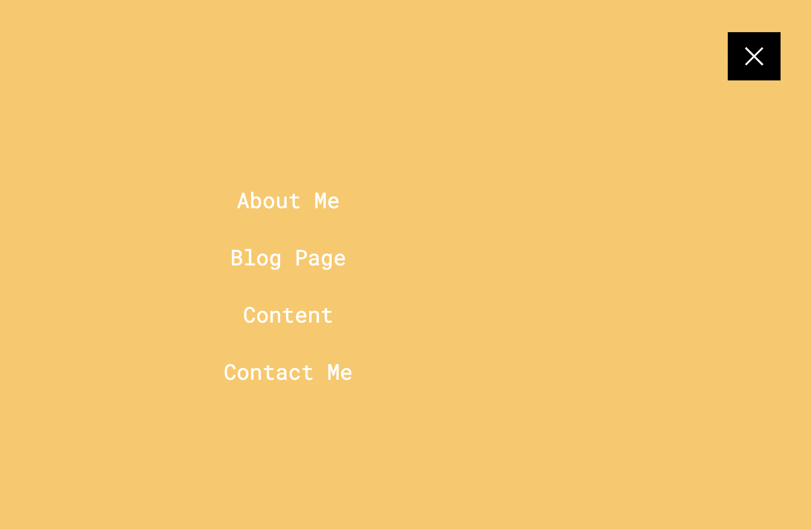
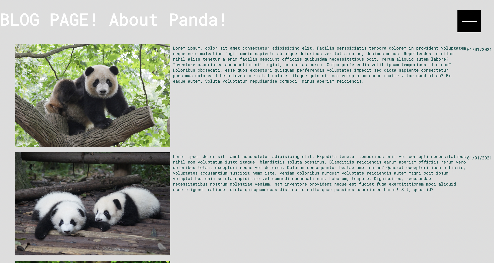
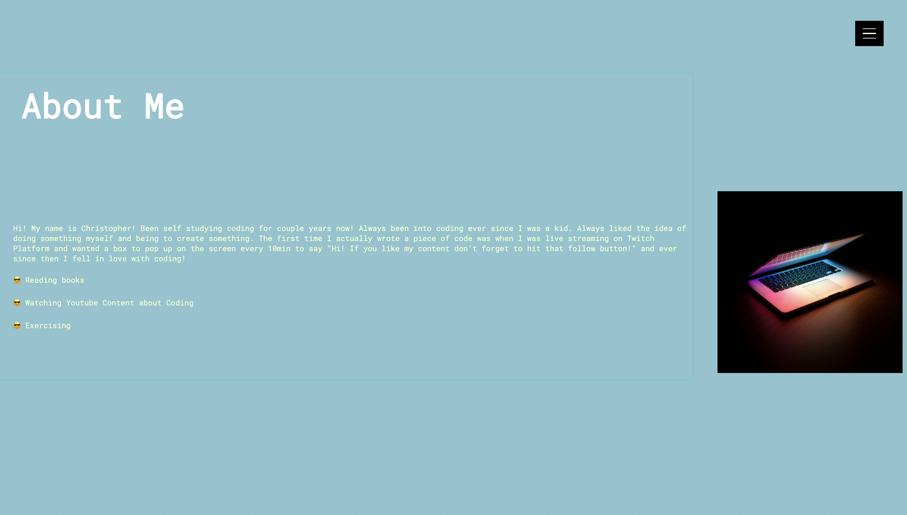
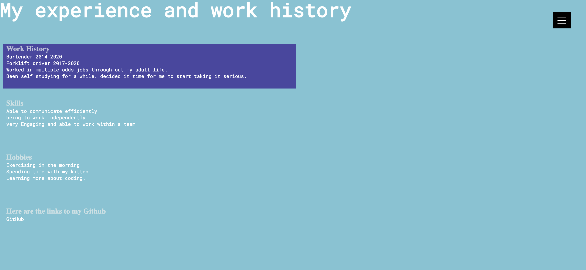
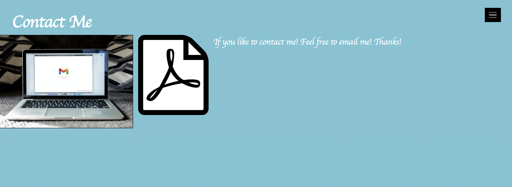
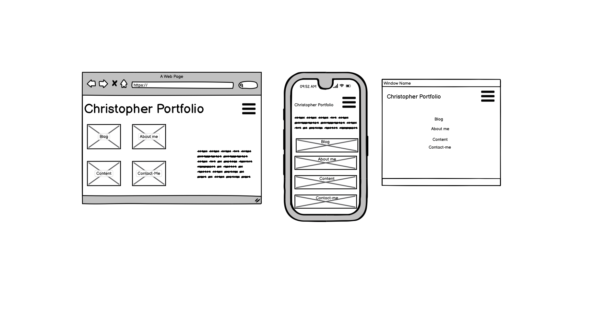
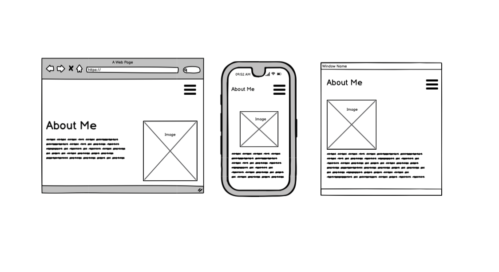
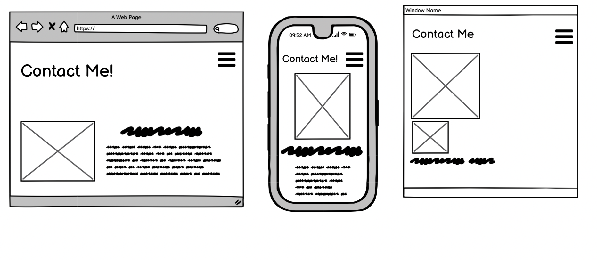

# Christopher Khut
## https://christopherk.netlify.app/
## Purpose

1. Understanding more on components. 
2. Learning to debug more. 
3. Showing the audience on what I can do 
4. Getting a better understanding on how to build a website.
 

## Functionality / Features

1. Hamburger Navigation bar 
2.CSS Animation/transition when hovering on links. 
3.Mailto components when clicking on email image. 
4.Able to download PDF resume through clicking images.

## Targeted audience 

The targeted audience was meant to be for adults and people looking to hire staff.

 

## Teck Stack

HTML & CSS  
Deployment on Netlify
